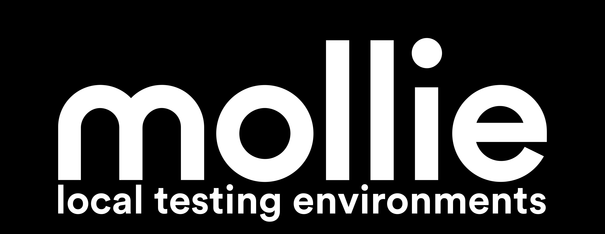

<h1 align="center">
  <br/>
  Mollie Local Testing Environments
</h1>
<p align="center">Create a new test-ready webshop with <b>database</b> (MySql), <b>frontend</b> (PHP),<br/> <b>email testing</b> (MailHog) and the <b>Mollie plugin</b> by running a few CLI commands.

## 🐳 Docker-way to ⚡️ Quick start

First, [download](https://docs.docker.com/engine/install/) and install the **Docker Engine**. Version `4.9.1` is recommended.

Installation is done by downloading this repo with the **[`git clone`](https://git-scm.com/docs/git-clone)** command in terminal:

```bash
git clone https://github.com/SalimAtMollie/Mollie-Local-Testing-Environments MollieEnvironments
```

Let's enter that new downloaded project via the **cd** command:

```bash
cd MollieEnvironments
```

Next, we will run the command which will **allow** you to run the **`startup.sh`** file:

```bash
chmod u+x ./startup.sh
```

Once this is done and you're ready, we can **start the system** by  executing the **`startup.sh`** file with:

```bash
./startup.sh
```

That's all you need to do to start! 🎉

> 🔔 Please note: You would need to **cd** into the **`MollieEnvironment`** directory to use the **`startup.sh`** file, otherwise it will not work.
